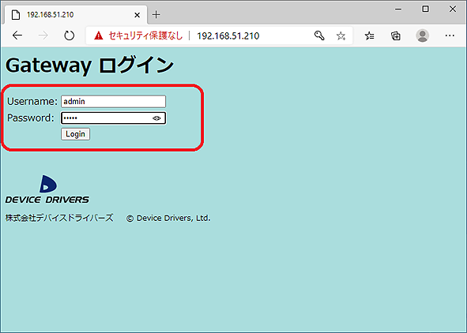
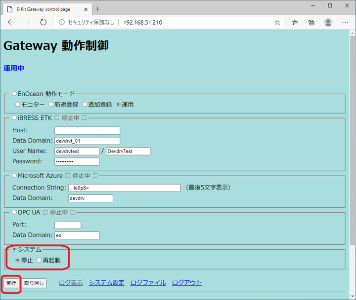
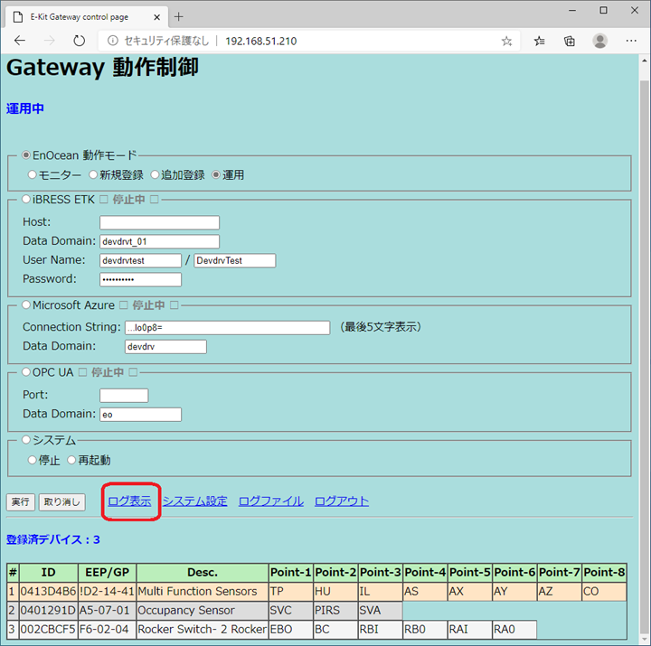
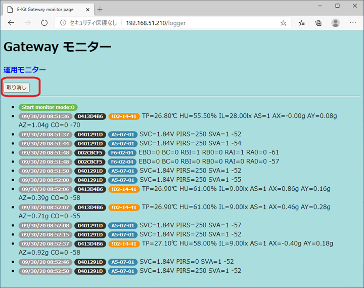

# MakerFaireDemo

Maker Faire Tokyo 2020 Algyan EnOcean デモ手順

 

## 機材と付属品

内容物をお確かめください。

 

### Windows タブレット
- 本体 Samsung Tablet PC
- ACアダプター（黒）
- Bluetooth キーボード（黒、ELECOM製、ペアリング済）
- Bluetooth マウス（黒＋水色、Microsoft製、ペアリング済）
- USB - Ethernet アダプター（Microsoft製）

### EnOceam ゲートウェイ
- 本体（黒、アンテナ付）
- ACアダプター（黒）
- LANケーブル（白色）

### EnOceam センサー
- Optex 人感センサー（黒）
- Optex ロッカースイッチ（黒）
- EnOceanマルチセンサー（長方形磁石 付属）

 

## LAN接続

### Windows タブレット = LANケーブル = EnOceam ゲートウェイ

 

## 電源投入とゲートウェイへのログイン

電源投入の順番は特にありません。

### Windows タブレット
- ACアダプター接続後、本体横の **凹んだ長方形ボタン** を爪先などで1秒程度押します。 
  内蔵バッテリーが消耗しているため、ACアダプター無しだと30分程度しか持ちません。ご注意ください。

### EnOceam ゲートウェイ
- 電源ボタンはありません。ACアダプター接続で直ぐに電源が入ります。

 

### Windows からゲートウェイへのログイン

Windows タブレットを起動後、Edge ブラウザで、 
**192.168.51.210**  
に接続して下さい。続いて、ログインします。  
**Username: admin**  
**Password: admin** 

キーボードは、通常5文字程度の入力では問題になることは、ほとんどありませんが、
万が一何かの時に10文字以上入力する場合には、キーボードチャタリングがひどいので注意して下さい。

 

## 電源切断手順

### EnOceam ゲートウェイ

- ブラウザで操作して、**運用モニター/ログ表示画面** の左上の取り消しをクリックして、動作制御画面に移動します。

    メニュー下方、**システム** ボタンの **停止** ボタンをクリック・有効化した後で、**実行** ボタンをクリックします。5秒ぐらいすると、ゲートウェイ本体のLANコネクターのLEDが消えるので、ACアダプターを外して下さい。

 

### Windows タブレット
- マウスまたはタッチパネルで操作して、スタートボタンから通常のシャットダウンをしてください。

 

## デモ

本来は動作制御画面の設定により、iBRESS Cloud, Azure IoT Hub, OPC UA に接続したデモが可能ですが、今回は回線設備の関係でローカル接続だけのデモとします。

ログイン後表示される以下のGateway 動作制御画面で、**ログ表示** をクリックすると、**運用モニター画面** に移動します。

 

**運用モニター画面** では、EnOceanの次のセンサーのデータをブラウザ画面に表示します。

- Optex 人感センサー  
  赤外線の反射で人の所在を検知して電波を送信します。定期的、または変化があったときに状態を電波で通知します。

- Optex ロッカースイッチ  
  左右、上下のスイッチ4か所を押したとき、押した力で発電してどのボタンが押されたかを通知します。

- EnOceanマルチセンサー  
  温度、湿度、照度、3軸加速度、マグネット・コンタクト（開閉センサー）の状態を通知します。定期的、または開閉センサーに変化があった場合に電波が飛びます。

 

以上
